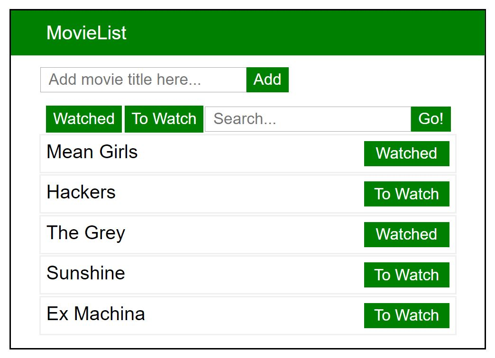

# Movie List MVP
This project was a small ReactJS MVP made in just a few hours. It features a text box to add new movies, a search bar to search through the current movies in the list, and buttons to toggle 'Watched' or 'To Watch' for each movie. The 'Watched' and 'To Watch' buttons at the top filter the results with the criteria, and the seach bar is a simple character match.

## Installation
First, clone the repository to your machine using your preferred git bash terminal

`git clone https://github.com/blackwayv/ghrbld06-movie-list.git`

Then, install, build, and start the app!

`npm install`

`npm run build`

`npm start`

### Built With
* JavaScript
* ReactJS
* HTML5/CSS
